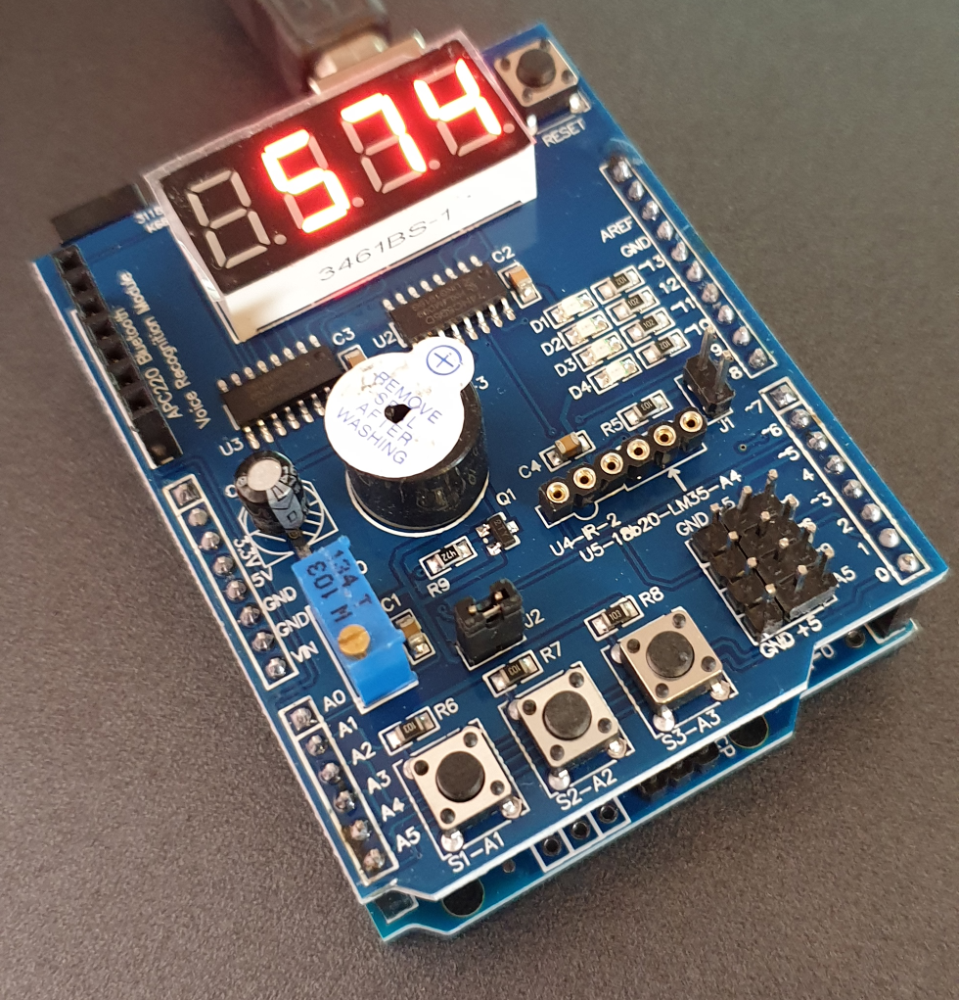
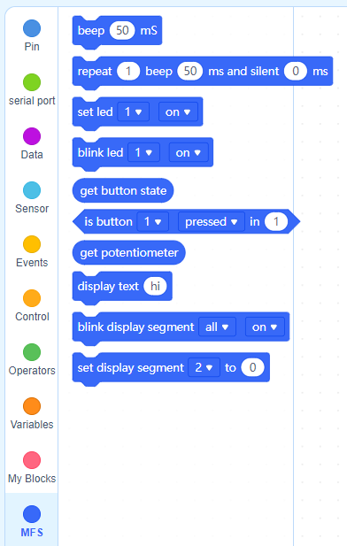
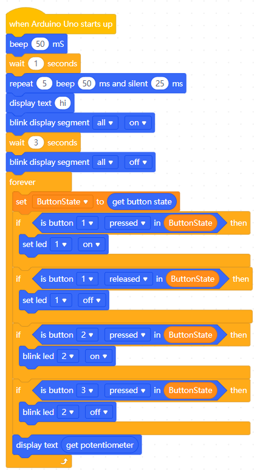

 

# mfshieldext

mfshieldext is an mBlock extension for the Multi Function Shield, a generic IO shield for the Arduino. 
mBlock is a scratch like environment which support several hardware platforms, including the Arduino.
This extension is made with the online extension editor.

The Multi Function Shield contains:
* 4x leds
* 3x push buttons
* 4x 7 segments display
* 1x buzzer
* 1x poteniometer
* and some interface for external sensors

For the Arduino IDE there is library available at https://www.cohesivecomputing.co.uk/hackatronics/arduino-multi-function-shield/.
You can also find a nice pdf manual for the use of it. This extension is based on version 1.2 of the multi-function-shield library.

## Provided mBlock Blocks
You can the extension in the extension center under the name MF Shield.
It will add a tab called MFS to you block palete.

With the following blocks:
* command: beep [length] ms
* command: repeat [count] beep [length] ms and silent [length] ms
* command: set led [number] [on|off]
* command: blink led [number] [on|off]
* number: get button state
* boolean: is button [number] [state] in [value]
* number: get potentiometer
* command: display [text]
* command: blink display segement [number] [on|off]
* command: set display segement [number] to [raw value]

Most blocks spears for itself, only *get button state* vs *is button [number] [state] in [value]* needs some more clarification.
The used multi-function-shield library stores changes to the push buttons in a queue.
*get button state* will get the first one from the queue, in this way using it muliple times one after the other will result in missing button events. 
If *is button [number] [state] in [value]* is used only once in your loop you can use *get button state* as value. In case you need *is button [number] [state] in [value]* multiple times it will require to call on top of loop *get button state* once and store the value in a variable. This variable can then be used by *is button [number] [state] in [value]*.
See the example for the use of it.

## Development
This extension is created with the online extension editor which can be found at https://ext.mblock.cc/.

The first time go to the extension overview and press import data to import the .mext file from this project.
For trying out changes
* In the extension center use the download  button of the extension.
* Open mBlock
* Drop the downloaded file on mBlock
* Restart mBlock

For updating the development variant repeat the same process.

## Use

To add this extension to your mBlock enivronment:
* Open a new project in the mBlock application or the online enviroment.
* Add a arduino device, remove the default
* Press the button extensions in the block palette
* Search for the MF Shield  extension in the extension center
* Press the + up in right upper corner download it (not needed in the online environment)
* Press the Add button

## Example
An example project that demonstrates the use of most block is provided at https://ide.mblock.cc/#/?cloudProjectId=161721.

